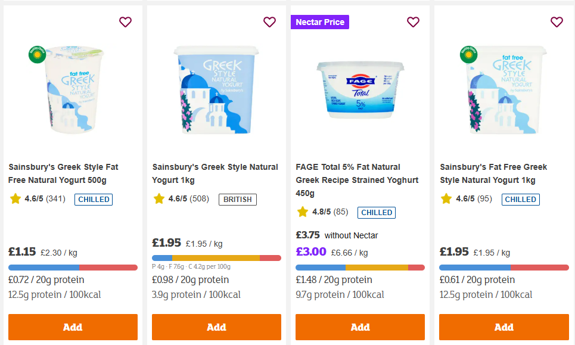

# Sainsbury's Nutrition Hints

A Chrome extension that overlays nutrition information on Sainsbury's grocery pages.

## Features

- Shows protein, fat, carb distribution on each product card
- Displays price-per-gram-of-protein for easy comparison
- Sort products within page by cost-per-protein or protein-per-kcal
- Pulls updated data when available

## Scraping

- A little rude but necessary here as the ratelimits are too fierce to fetch this info on the fly during normal browsing
- Scraper tool crawls the site once for food product pages to cache nutritional info into ~2MB json, hosted for use by extension
- Extension stores data in storage and performs last-modified check to avoid redundant downloads
- Info updates very rarely, total scraping activity tiny

## Project structure

- `scraper/` — Node.js scraper using Puppeteer + Cheerio
- `extension/` — Chrome extension (Manifest V3, TypeScript, esbuild)
- `api-reference/` — Scratch work to maintain examples for navigating sainsburys pages programatically

## License

[MIT](LICENSE)

## Privacy

This gathers nothing.